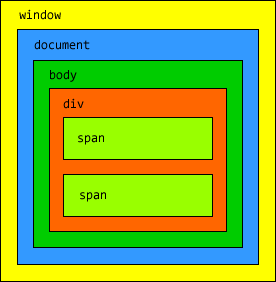

# javascript-21v

Взаимодействие с пользователем: alert, prompt, confirm
======================================================

alert
------
```
alert(сообщение)
```
alert выводит на экран окно с сообщением и приостанавливает выполнение скрипта, пока пользователь не нажмёт «ОК».
```
alert( "Привет" );
```
Окно сообщения, которое выводится, является модальным окном. Слово «модальное» означает, что посетитель не может взаимодействовать со страницей, нажимать другие кнопки и т.п., пока не  нажмёт на «OK».

prompt
------
Функция prompt принимает два аргумента:
```
result = prompt(title, default);
```
Она выводит модальное окно с заголовком title, полем для ввода текста, заполненным строкой по умолчанию default и кнопками OK/CANCEL.

Пользователь должен либо что-то ввести и нажать OK, либо отменить ввод кликом на CANCEL или нажатием Esc на клавиатуре.

Вызов prompt возвращает то, что ввёл посетитель — строку или специальное значение null, если ввод отменён. Safari 5.1+ не возвращает null

Единственный браузер, который не возвращает null при отмене ввода — это Safari. При отсутствии ввода он возвращает пустую строку. Предположительно, это ошибка в браузере.
Если нам важен этот браузер, то пустую строку нужно обрабатывать точно так же, как и null, т.е. считать отменой ввода.

Как и в случае с alert, окно prompt модальное.
```
var years = prompt('Сколько вам лет?', 100);

alert('Вам ' + years + ' лет!')
```
Всегда указывайте default
Второй параметр может отсутствовать. Однако при этом IE вставит в диалог значение по умолчанию "undefined".
Запустите этот код в IE, чтобы понять о чём речь:
```
var test = prompt("Тест");
```
Поэтому рекомендуется всегда указывать второй аргумент:
```
var test = prompt("Тест", ''); // <-- так лучше
```
confirm
--------
```
result = confirm(question);
```
confirm выводит окно с вопросом question с двумя кнопками: OK и CANCEL.

Результатом будет true при нажатии OK и false – при CANCEL(Esc).

```
var isAdmin = confirm("Вы - администратор?");

alert( isAdmin );
```
Особенности встроенных функций
--------------------------------
Конкретное место, где выводится модальное окно с вопросом — обычно это центр браузера, и внешний вид окна выбирает браузер. Разработчик не может на это влиять.

Шесть типов данных, typeof
==========================
В JavaScript существует несколько основных типов данных.

Число «number»
--------------
```
var n = 123;
n = 12.345;
```
Единый тип число используется как для целых, так и для дробных чисел.

Существуют специальные числовые значения Infinity (бесконечность) и NaN (ошибка вычислений).

Например, бесконечность Infinity получается при делении на ноль:
```
alert( 1 / 0 ); // Infinity
```
Ошибка вычислений NaN будет результатом некорректной математической операции, например:
```
alert( "нечисло" * 2 ); // NaN, ошибка
```
Эти значения формально принадлежат типу «число», хотя, конечно, числами в их обычном понимании не являются.

Строка «string»
----------------
```
var str = "Мама мыла раму";
str = 'Одинарные кавычки тоже подойдут';
```
В JavaScript одинарные и двойные кавычки равноправны. Можно использовать или те или другие.

Тип символ не существует, есть только строка.

Булевый (логический) тип «boolean»
-----------------------------------
У него всего два значения: true (истина) и false (ложь).

Как правило, такой тип используется для хранения значения типа да/нет, например:
```
var checked = true; // поле формы помечено галочкой
checked = false;    // поле формы не содержит галочки
```
Специальное значение «null»
---------------------------
Значение null не относится ни к одному из типов выше, а образует свой отдельный тип, состоящий из единственного значения null:
```
var age = null;
```
В JavaScript null не является «ссылкой на несуществующий объект» или «нулевым указателем», как в некоторых других языках. Это просто специальное значение, которое имеет смысл «ничего» или «значение неизвестно».

Специальное значение «undefined»
--------------------------------
Значение undefined, как и null, образует свой собственный тип, состоящий из одного этого значения. Оно имеет смысл «значение не присвоено».

Если переменная объявлена, но в неё ничего не записано, то её значение как раз и есть undefined:
```
var x;
alert( x ); // выведет "undefined"
```
Можно присвоить undefined и в явном виде, хотя это делается редко:
```
var x = 123;
x = undefined;

alert( x ); // "undefined"
```
В явном виде undefined обычно не присваивают, так как это противоречит его смыслу. Для записи в переменную «пустого» или «неизвестного» значения используется null.

Объекты «object»
----------------
Первые 5 типов называют «примитивными».

Особняком стоит шестой тип: «объекты».

Он используется для коллекций данных и для объявления более сложных сущностей.

Объявляются объекты при помощи фигурных скобок {...}, например:
```
var user = { name: "Вася" };
```

Оператор typeof
----------------
Оператор typeof возвращает тип аргумента.

У него есть два синтаксиса: со скобками и без:

1. Синтаксис оператора: typeof x.
2. Синтаксис функции: typeof(x).
Работают они одинаково, но первый синтаксис короче.

Результатом typeof является строка, содержащая тип:

```
typeof undefined // "undefined"

typeof 0 // "number"

typeof true // "boolean"

typeof "foo" // "string"

typeof {} // "object"

typeof null // "object"  (1)

typeof function(){} // "function"  (2)
```

Результат typeof null == "object" — это официально признанная ошибка в языке, которая сохраняется для совместимости. На самом деле null — это не объект, а отдельный тип данных.

Условные операторы: if, '?'
---------------------------
Иногда, в зависимости от условия, нужно выполнить различные действия. Для этого используется оператор if.
```

var year = prompt('В каком году появилась спецификация ECMA-262 5.1?', '');

if (year != 2011) alert( 'А вот и неправильно!' );
```
Оператор if
-----------
Оператор if («если») получает условие, в примере выше это year != 2011. Он вычисляет его, и если результат — true, то выполняет команду.

Если нужно выполнить более одной команды — они оформляются блоком кода в фигурных скобках:
```
if (year != 2011) {
  alert( 'А вот..' );
  alert( '..и неправильно!' );
}
```
Рекомендуется использовать фигурные скобки всегда, даже когда команда одна.

Это улучшает читаемость кода.

Преобразование к логическому типу
-----------------------------------
Оператор if (...) вычисляет и преобразует выражение в скобках к логическому типу.

Число 0, пустая строка "", null и undefined, а также NaN являются false,
------------------------------------------------------------------------
Остальные значения — true.
--------------------------
Например, такое условие никогда не выполнится:
```
if (0) { // 0 преобразуется к false
  ...
}
```
…А такое — выполнится всегда:
```
if (1) { // 1 преобразуется к true
  ...
}
```
Можно и просто передать уже готовое логическое значение, к примеру, заранее вычисленное в переменной:
```
var cond = (year != 2011); // true/false

if (cond) {
  ...
}
```
Неверное условие, else
----------------------
Необязательный блок else («иначе») выполняется, если условие неверно:
```
var year = prompt('Введите год появления стандарта ECMA-262 5.1', '');

if (year == 2011) {
  alert( 'Да вы знаток!' );
} else {
  alert( 'А вот и неправильно!' ); // любое значение, кроме 2011
}
```
Несколько условий, else if
--------------------------
Бывает нужно проверить несколько вариантов условия. Для этого используется блок else if .... Например:
```
var year = prompt('В каком году появилась спецификация ECMA-262 5.1?', '');

if (year < 2011) {
  alert( 'Это слишком рано..' );
} else if (year > 2011) {
  alert( 'Это поздновато..' );
} else {
  alert( 'Да, точно в этом году!' );
}
```
В примере выше JavaScript сначала проверит первое условие, если оно ложно — перейдет ко второму — и так далее, до последнего else.

Цикл for
----------
Чаще всего применяется цикл for. Выглядит он так:
```
for (начало; условие; шаг) {
  // ... тело цикла ...
}
```
Пример цикла, который выполняет alert(i) для i от 0 до 2 включительно (до 3):
```
var i;

for (i = 0; i < 3; i++) {
  alert( i );
}
```
Здесь:

- Начало: i=0.
- Условие: i<3.
- Шаг: i++.
- Тело: alert(i), т.е. код внутри фигурных скобок (они не обязательны, если только одна операция)

Цикл выполняется так:
----------------------
- Начало: i=0 выполняется один-единственный раз, при заходе в цикл.
- Условие: i<3 проверяется перед каждой итерацией и при входе в цикл, если оно нарушено, то происходит выход.
- Тело: alert(i).
- Шаг: i++ выполняется после тела на каждой итерации, но перед проверкой условия.
- Идти на шаг 2.
Иными словами, поток выполнения: начало → (если условие → тело → шаг) → (если условие → тело → шаг) → … и так далее, пока верно условие.

В цикле также можно определить переменную:
```
for (var i = 0; i < 3; i++) {
  alert(i); // 0, 1, 2
}
```
Эта переменная будет видна и за границами цикла, в частности, после окончания цикла i станет равно 3.

Пропуск частей for
------------------
Любая часть for может быть пропущена.

Например, можно убрать начало. Цикл в примере ниже полностью идентичен приведённому выше:
```
var i = 0;

for (; i < 3; i++) {
  alert( i ); // 0, 1, 2
}
```
Можно убрать и шаг:
```
var i = 0;

for (; i < 3;) {
  alert( i );
  // цикл превратился в аналог while (i<3)
}
```
А можно и вообще убрать всё, получив бесконечный цикл:
```
for (;;) {
  // будет выполняться вечно
}
```
При этом сами точки с запятой ; обязательно должны присутствовать, иначе будет ошибка синтаксиса.

методы и свойства
=================
Все значения в JavaScript, за исключением null и undefined, содержат набор вспомогательных функций и значений, доступных «через точку».

Такие функции называют «методами», а значения — «свойствами». 

Свойство str.length
-------------------

У строки есть свойство length, содержащее длину:
```
alert( "Привет, мир!".length ); // 12
```
Можно и записать строку в переменную, а потом запросить её свойство:
```
var str = "Привет, мир!";
alert( str.length ); // 12
```
Массивы c числовыми индексами
------------------------------
Массив — разновидность объекта, которая предназначена для хранения пронумерованных значений и предлагает дополнительные методы для удобного манипулирования такой коллекцией.

Они обычно используются для хранения упорядоченных коллекций данных, например — списка товаров на странице, студентов в группе и т.п.

Синтаксис для создания нового массива — квадратные скобки со списком элементов внутри.
--------------------------------------------------------------------------------------
Пустой массив:
--------------
```
var arr = [];
```
Массив fruits с тремя элементами:
```
var fruits = ["Яблоко", "Апельсин", "Слива"];
```
Элементы нумеруются, начиная с нуля.

Чтобы получить нужный элемент из массива — указывается его номер в квадратных скобках:
```
var fruits = ["Яблоко", "Апельсин", "Слива"];

alert( fruits[0] ); // Яблоко
alert( fruits[1] ); // Апельсин
alert( fruits[2] ); // Слива
```
Элемент можно всегда заменить:
------------------------------
```
fruits[2] = 'Груша'; // теперь ["Яблоко", "Апельсин", "Груша"]
```
…Или добавить:
--------------
```
fruits[3] = 'Лимон'; // теперь ["Яблоко", "Апельсин", "Груша", "Лимон"]
```
Общее число элементов, хранимых в массиве, содержится в его свойстве length:
----------------------------------------------------------------------------
```
var fruits = ["Яблоко", "Апельсин", "Груша"];

alert( fruits.length ); // 3
```
Через alert можно вывести и массив целиком.

При этом его элементы будут перечислены через запятую:
```
var fruits = ["Яблоко", "Апельсин", "Груша"];

alert( fruits ); // Яблоко,Апельсин,Груша
```
В массиве может храниться любое число элементов любого типа.

В том числе, строки, числа, объекты, вот например:
```
// микс значений
var arr = [ 1, 'Имя', { name: 'Петя' }, true ];

// получить объект из массива и тут же -- его свойство
alert( arr[2].name ); // Петя
```
Внутреннее устройство массива
------------------------------
Массив — это объект, где в качестве ключей выбраны цифры, с дополнительными методами и свойством length.
```
var arr = ["нам", "не", "страшен", "серый", "волк"]

alert( arr.length ); // 5
eat(arr);
eat(arr);
alert( arr.length ); // 3, в функцию массив не скопирован, а передана ссылка
```
Ещё одно следствие — можно присваивать в массив любые свойства.
----------------------------------------------------------------
Например:
```
var fruits = []; // создать массив

fruits[99999] = 5; // присвоить свойство с любым номером

fruits.age = 25; // назначить свойство со строковым именем
```
.. Но массивы для того и придуманы в JavaScript, чтобы удобно работать именно с упорядоченными, нумерованными данными. Для этого в них существуют специальные методы и свойство length.

Перебор элементов
-----------------
Для перебора элементов обычно используется цикл:

```
var arr = ["Яблоко", "Апельсин", "Груша"];

for (var i = 0; i < arr.length; i++) {
  alert( arr[i] );
}
```
Цикл 
```
for (var i=0; i<arr.length; i++) 
```
в современных браузерах выполняется в 10-100 раз быстрее. Казалось бы, по виду он сложнее, но браузер особым образом оптимизирует такие циклы.

Особенности работы length
-------------------------
Встроенные методы для работы с массивом автоматически обновляют его длину length.

Длина length — не количество элементов массива, а последний индекс + 1.

Это легко увидеть на следующем примере:
```
var arr = [];
arr[1000] = true;

alert(arr.length); // 1001
```
Кстати, если у вас элементы массива нумеруются случайно или с большими пропусками, то стоит подумать о том, чтобы использовать обычный объект. Массивы предназначены именно для работы с непрерывной упорядоченной коллекцией элементов.

Используем length для укорачивания массива
------------------------------------------
Обычно нам не нужно самостоятельно менять length… Но есть один фокус, который можно провернуть.

При уменьшении length массив укорачивается.

Причем этот процесс необратимый, т.е. даже если потом вернуть length обратно — значения не восстановятся:
```
var arr = [1, 2, 3, 4, 5];

arr.length = 2; // укоротить до 2 элементов
alert( arr ); // [1, 2]

arr.length = 5; // вернуть length обратно, как было
alert( arr[3] ); // undefined: значения не вернулись
```
Самый простой способ очистить массив — это arr.length=0.
--------------------------------------------------------
Создание вызовом new Array
---------------------------
```
new Array()
```
Существует еще один синтаксис для создания массива:
```
var arr = new Array("Яблоко", "Груша", "и т.п.");
```
Он редко используется, т.к. квадратные скобки [] короче.

Кроме того, у него есть одна особенность. Обычно new Array(элементы, ...) создаёт массив из данных элементов, но если у него один аргумент-число new Array(число), то он создает массив без элементов, но с заданной длиной.

Проверим это:
```
var arr = new Array(2, 3);
alert( arr[0] ); // 2, создан массив [2, 3], всё ок

arr = new Array(2); // создаст массив [2] ?
alert( arr[0] ); // undefined! у нас массив без элементов, длины 2
```
Что же такое этот «массив без элементов, но с длиной»? Как такое возможно?

Оказывается, очень даже возможно и соответствует объекту {length: 2}. Получившийся массив ведёт себя так, как будто его элементы равны undefined.

Это может быть неожиданным сюрпризом, поэтому обычно используют квадратные скобки.

Многомерные массивы
--------------------
Массивы в JavaScript могут содержать в качестве элементов другие массивы. Это можно использовать для создания многомерных массивов, например матриц:
```
var matrix = [
  [1, 2, 3],
  [4, 5, 6],
  [7, 8, 9]
];

alert( matrix[1][1] ); // центральный элемент
```
DOM или объектная модель документа
===================================

Данный html-код:
```
<html>
<head>
    <title>Hello, JavaScript!</title>
</head>
<body>
    <div>
        <span>Раз</span>
        <span>Два</span>
    </div>
</body>
</html>
```
Сформирует следующую структуру DOM:
-----------------------------------


во главе всего у нас кореневой объект window, который внутри себя содержит объект document, который в свою очередь содержит объект body, а объект body - все остальные объекты, которые тоже могут содежать другие объекты.
```
<html>
<head>
    <title>Hello, JavaScript!</title>
    <script>
    window.onload = function(){
        alert(window.document.body.innerHTML);
    }
    </script>
</head>
<body>
    <div>
        <span>Раз</span>
        <span>Два</span>
    </div>
</body>
</html>
```
innerHTML - свойство, объекта document, которое используеться если нужно вытащить код из HTML-документа или поменять его.

Следующий фрагмент кода затрёт все содержимое объекта body, а вместо него выведет слово пусто.
```
<html>
<head>
    <title>Hello, JavaScript!</title>
    <script>
    window.onload = function(){
        window.document.body.innerHTML = '(пусто)';
    }
    </script>
</head>
<body>
    <div>
        <span>Раз</span>
        <span>Два</span>
    </div>
</body>
</html>
```
document.body.children
-----------------------
Хотя если мы посмотрим в исходный код, то увидим что старая структура элементов у нас осталась, но зато в инспекторе будет отображаться только надпись пусто.

Чтобы получить доступ к нашему div мы уже не можем использовать конкатынацию строк, но у каждого элемента объектной модели документа есть свойство children - это массив его детей, где мы по индексу можем обращаться к детям. Поскольку div у нас первый и единственный потомок тега body, то можно использовать следующую конструкцию, которая покажет нам внутренний HTML код указанного потомка:
```
<html>
<head>
    <title>Hello, JavaScript!</title>
    <script>
    window.onload = function(){
        alert(window.document.body.children[0].innerHTML);
    }
    </script>
</head>
<body>
    <div>
        <span>Раз</span>
        <span>Два</span>
    </div>
</body>
</html>

document.body.children
-----------------------
```
Такое ображение не очень удобное, поэтому мы можем занести вышеуказнное выражение в переменную и использовать далее именно её:
```
<html>
<head>
    <title>Hello, JavaScript!</title>
    <script>
    window.onload = function(){
        var div = window.document.body.children[0];
        alert(div.innerHTML);
    }
    </script>
</head>
<body>
    <div>
        <span>Раз</span>
        <span>Два</span>
    </div>
</body>
</html>
```
document.body.children
----------------------
Чтобы получить доступ к тегам span нужно использовать уже ранее созданную переменную и обращаться к дочерним элементам этой перенной - к дочерним элементам тега div:
```
<html>
<head>
    <title>Hello, JavaScript!</title>
    <script>
    window.onload = function(){
        var div = window.document.body.children[0];
        var span2 = div.children[1];
        alert(span2.innerHTML);
    }
    </script>
</head>
<body>
    <div>
        <span>Раз</span>
        <span>Два</span>
    </div>
</body>
</html>
```
lenght
-------
С помощью свойства lenght можно узнать длинну массива - тоесть количество элементов в массиве.
```
<html>
<head>
    <title>Hello, JavaScript!</title>
    <script>
    window.onload = function(){
        var div = window.document.body.children[0];
        alert(div.children.length);
    }
    </script>
</head>
<body>
    <div>
        <span>Раз</span>
        <span>Два</span>
    </div>
</body>
</html>
```
innerHTML
---------
Также мы можем устанавливать innerHTML не только для body, но и для любого другого элемента:
```
<html>
<head>
    <title>Hello, JavaScript!</title>
    <script>
    window.onload = function(){
        var div = window.document.body.children[0];
        var span2 = div.children[1];
        span2.innerHTML = '2';
    }
    </script>
</head>
<body>
    <div>
        <span>Раз</span>
        <span>Два</span>
    </div>
</body>
</html>
```
parentNode
----------
parentNode - выведет ссылку на родительский элемент.
```
<html>
<head>
    <title>Hello, JavaScript!</title>
    <script>
    window.onload = function(){
        var div = window.document.body.children[0];
        var span2 = div.children[1];
        alert(span2.parentNode.innerHTML);
    }
    </script>
</head>
<body>
    <div>
        <span>Раз</span>
        <span>Два</span>
    </div>
</body>
</html>
```

У каждого элемента есть свойство innerHTML, которое позволяет получить содержимое элемента в виде HTML кода - его можно как читать так и записывать в него.
У каждого объекта есть массив потомков, мы можем узнать размер этого массива с помощью свойства length и обращаться к каждого элементу данного массива по индексу с помощью свойства children[].
У каждого элемента есть свойство parentNode, которое указывает на родителя.

Функция getElementById 
=======================
позволяет быстро получать доступ к элементам - принимает строкое значение идентификатора и возвращает DOM-объект, а если такого элемента не найдено, то возвращает NULL.

index.html
----------
```
    <article>
        <h3>Sidebar Menu</h3>
  
            <div id="menu_body"> 
   
            </div> 
     </article>

<script type="text/javascript">
    var parent_menu = document.getElementById('menu_body');
</script>
```
Создание элемента
==================
Для создания элементов используются следующие методы:

document.createElement(tag)
---------------------------
Создает новый элемент с указанным тегом:
```
var div = document.createElement('div');
```
index.html
----------
```
    <article>
        <h3>Sidebar Menu</h3>
  
            <div id="menu_body"> 
   
            </div> 
     </article>

<script>
 var parent_menu = document.getElementById('menu_body');

 var ul = document.createElement('ul');
</script>    

```
После этого кода у нас есть готовый DOM-элемент. Пока что он присвоен в переменную ul, но не виден, так как никак не связан со страницей.

document.createTextNode(text)
-----------------------------
Создает новый текстовый узел с данным текстом:
```
var textElem = document.createTextNode('Тут был я');
```
index.html
----------
```
    <article>
        <h3>Sidebar Menu</h3>
  
            <div id="menu_body"> 
   
            </div> 
     </article>

<script>
 var parent_menu = document.getElementById('menu_body');

 var ul = document.createElement('ul');
 var li1 = document.createElement('li');
 var a1 = document.createElement('a');
 var t1 = document.createTextNode('Menu');

</script>    
```
Добавление элемента: appendChild, insertBefore
-----------------------------------------------
Чтобы DOM-узел был показан на странице, его необходимо вставить в document.

вставлять будем в элемент parent_menu.

Для вставки внутрь parent_menu есть следующие методы:
----------------------------------------------------
parent_menu.appendChild(elem)
----------------------------
Добавляет elem в конец дочерних элементов parent_menu.

index.html
----------
```
    <article>
        <h3>Sidebar Menu</h3>
  
            <div id="menu_body"> 
   
            </div> 
     </article>

<script>
 var parent_menu = document.getElementById('menu_body');

 var ul = document.createElement('ul');
 var li1 = document.createElement('li');
 var a1 = document.createElement('a');
 var t1 = document.createTextNode('Menu');
 a1.appendChild(t1);
 li1.appendChild(a1);
 ul.appendChild(li1);
 parent_menu.appendChild(ul);
</script>    
```

index.html
----------
```
    <article>
        <h3>Sidebar Menu</h3>
  
            <div id="menu_body"> 
   
            </div> 
     </article>

<script>
 var parent_menu = document.getElementById('menu_body');

 var ul = document.createElement('ul');

 var createMenu = function () {
    for (var i = 0; i < 10; i++) {
        var li1 = document.createElement('li');
        var a1 = document.createElement('a');
        a1.appendChild(document.createTextNode('Menu'+i));
 
        li1.appendChild(a1);
        ul.appendChild(li1);
      }
    parent_menu.appendChild(ul);
 };

</script>
```
Загрузка документа: 
===================

Процесс загрузки HTML-документа, условно, состоит из трёх стадий:

- DOMContentLoaded — браузер полностью загрузил HTML, и построил DOM-дерево.
- load — браузер загрузил все ресурсы.
- beforeunload/unload — уход со страницы.

На каждую можно повесить обработчик, чтобы совершить полезные действия:

- DOMContentLoaded — означает, что все DOM-элементы разметки уже созданы, можно их искать, вешать обработчики, создавать интерфейс, но при этом, возможно, ещё не догрузились какие-то картинки или стили.

- load — страница и все ресурсы загружены, используется редко, обычно нет нужды ждать этого момента.

- beforeunload/unload — можно проверить, сохранил ли посетитель изменения, уточнить, действительно ли он хочет покинуть страницу.

window.onload
=============
Обработчик window.onload срабатывает, когда загружается вся страница, включая ресурсы на ней — стили, картинки, ифреймы и т.п.

```
window.onload = function(){
  //
}> 
```
index.html
----------
```
    <article>
        <h3>Sidebar Menu</h3>
  
            <div id="menu_body"> 
   
            </div> 
     </article>

<script>
 var parent_menu = document.getElementById('menu_body');

 var ul = document.createElement('ul');

 var createMenu = function () {
    for (var i = 0; i < 10; i++) {
        var li1 = document.createElement('li');
        var a1 = document.createElement('a');
        a1.appendChild(document.createTextNode('Menu'+i));
 
        li1.appendChild(a1);
        ul.appendChild(li1);
      }
    parent_menu.appendChild(ul);
 };

window.onload=createMenu;

</script>
```
Атрибуты
=========
Элементам DOM соответствуют HTML-теги, у которых есть текстовые атрибуты.

Доступ к атрибутам осуществляется при помощи стандартных методов:

- elem.hasAttribute(name) – проверяет наличие атрибута
- elem.getAttribute(name) – получает значение атрибута
- elem.setAttribute(name, value) – устанавливает атрибут
- elem.removeAttribute(name) – удаляет атрибут
Эти методы работают со значением, которое находится в HTML.

Также все атрибуты элемента можно получить с помощью свойства elem.attributes, которое содержит псевдо-массив объектов типа Attr.

В отличие от свойств, атрибуты:
-------------------------------
- Всегда являются строками.
- Их имя нечувствительно к регистру (ведь это HTML)
- Видны в innerHTML (за исключением старых IE)

Ссылка «как есть» из атрибута href
----------------------------------
```
<a id="a" href="#"></a>
<script>
  a.href = '/';

  alert( 'атрибут:' + a.getAttribute('href') ); // '/'
  alert( 'свойство:' + a.href );  // полный URL

</script>
```
атрибут может быть любым, а свойство href, в соответствии со спецификацией W3C, должно быть полной ссылкой.

index.html
----------
```
<div id="menu_body"> 

</div>

<script>
 var parent_menu = document.getElementById('menu_body');

 var ul = document.createElement('ul');
 ul.setAttribute('id', 'ul1');

var createMenu = function () {
    for (var i = 0; i < 10; i++) {
        var li1 = document.createElement('li');
        var a1 = document.createElement('a');
        a1.appendChild(document.createTextNode('Menu'+i));
        a1.setAttribute('href', '#');
        li1.appendChild(a1);
        ul.appendChild(li1);
      }
    parent_menu.appendChild(ul);
};

window.onload=createMenu;

</script>
```
index.html
----------
```
            <div id="menu_body"> 
   
            </div> 

<script>
 var parent_menu = document.getElementById('menu_body');

 var ul = document.createElement('ul');
 ul.setAttribute('id', 'ul1');

var createMenu = function () {
    for (var i = 0; i < 10; i++) {
        var li1 = document.createElement('li');
        var a1 = document.createElement('a');
        a1.appendChild(document.createTextNode('Menu'+i));
        a1.setAttribute('href', '#');
        li1.appendChild(a1);
        var li2 = [], a2 = [];
        var ul1 = document.createElement('ul');
        
        for (var j = 0; j < i+1; j++) {
        
            li2[j] = document.createElement('li');
            a2[j] = document.createElement('a');
            a2[j].appendChild(document.createTextNode('Sub Menu'+j));
            a2[j].setAttribute('href', '#');
            li2[j].appendChild(a2[j]);
            ul1.appendChild(li2[j]);
        }
        
        li1.appendChild(ul1);
        
        ul.appendChild(li1);
      }
    parent_menu.appendChild(ul);
};

window.onload=createMenu;

</script>
```
Клонирование узлов: cloneNode
==============================
в ряде случаев гораздо эффективнее – клонировать существующий li, а потом изменить текст внутри a. В частности, если элемент большой, то клонировать его будет гораздо быстрее, чем пересоздавать.

Вызов elem.cloneNode(true) создаст «глубокую» копию элемента – вместе с атрибутами, включая подэлементы. Если же вызвать с аргументом false, то копия будет сделана без дочерних элементов. 

```
var parent_menu = document.getElementById('menu_body');

 var ul = document.createElement('ul');
 ul.setAttribute('id', 'ul1');

 var li1 = document.createElement('li');
 var a1 = document.createElement('a');
 a1.appendChild(document.createTextNode('Menu'+0));
 a1.setAttribute('href', '#');
 li1.appendChild(a1);

var createMenu = function () {
    for (var i = 0; i < 10; i++) {
  // создать копию узла
  var li_current = li1.cloneNode(true);
  a1.innerHTML = 'Menu'+(i+1);
        ul.appendChild(li_current);
      }
    parent_menu.appendChild(ul);
};

window.onload=createMenu;

```
querySelector
=============
Вызов elem.querySelector(css) возвращает не все, а только первый элемент, соответствующий CSS-селектору css.

Этот метод часто используется, когда мы заведомо знаем, что подходящий элемент только один, и хотим получить в переменную сразу его.
```
var parent_menu = document.getElementById('menu_body');

 var ul = document.createElement('ul');
 ul.setAttribute('id', 'ul1');

 var li1 = document.createElement('li');
 var a1 = document.createElement('a');
 a1.appendChild(document.createTextNode('Menu'+0));
 a1.setAttribute('href', '#');
 li1.appendChild(a1);

var createMenu = function () {
    for (var i = 0; i < 10; i++) {

  // создать копию узла
  var li_current = li1.cloneNode(true);
  a1.innerHTML = 'Menu'+(i+1);
 
        var li2 = [];
        var ul1 = document.createElement('ul');
        for (var j = 0; j < i+1; j++) {
            li2[j] = li_current.cloneNode(true); // создать копию узла
            // первый элемент, соответствующий CSS-селектору a
            li2[j].querySelector('a').innerHTML = 'Sub Menu'+(j+1);
            ul1.appendChild(li2[j]);
        }
        
        li_current.appendChild(ul1);
        
        ul.appendChild(li_current);
      }
    parent_menu.appendChild(ul);
};

window.onload=createMenu;
```
