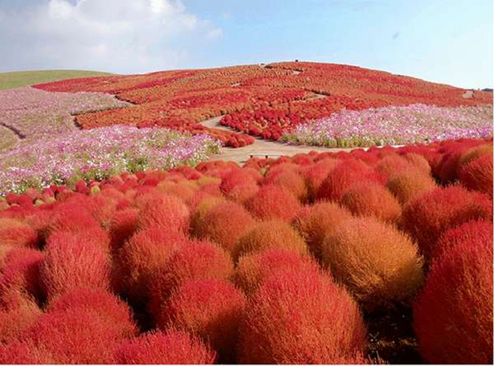

# javascript-21v
Slider
=====
html
----
```
        <div class="container">
            <div class="image-slider-wrapper">
                <ul id="image_slider">
                    <li></li>
                    <li></li>
                    <li></li>
                    <li></li>
                    <li></li>
                    <li></li>
                </ul>           
                <div class="pager">
                </div>
            </div>
        </div>
```

CSS
----
```
.container {
    width:100vw;
    height:50vh;
    padding:0;
    background: transparent;
}
.image-slider-wrapper{
    overflow: hidden;
}
#image_slider {
    position: relative;
    overflow: hidden;
    height: 45vh;
    padding:0;
    left:0;
}
#image_slider li {
    position:relative;
    width:100vw;
    max-width: 100%;
    float:left;
    list-style: none;
    left: 0;
}
.hero>article>span {
  position: absolute;
  top:50%;
  left: 50%;
  z-index: 100;
}
```
Коллекции
=======
childNodes, firstChild, lastChild
=================================

Псевдо-массив childNodes хранит все дочерние элементы, включая текстовые.

дочерние элементы document.body:
-------------------------------
```
<!DOCTYPE HTML>
<html>

<body>
  <div>Начало</div>

  <ul>
    <li>Информация</li>
  </ul>

  <div>Конец</div>

  <script>
    for (var i = 0; i < document.body.childNodes.length; i++) {
      alert( document.body.childNodes[i] ); // Text, DIV, Text, UL, ..., SCRIPT
    }
  </script>
  ...
</body>

</html>
```

Свойства firstChild и lastChild обеспечивают быстрый доступ к первому и последнему элементу.

При наличии дочерних узлов всегда верно:
```
elem.childNodes[0] === elem.firstChild
elem.childNodes[elem.childNodes.length - 1] === elem.lastChild
```

DOM-коллекции, такие как childNodes не являются JavaScript-массивами.

В них нет методов массивов, таких как forEach, map, push, pop и других.

Именно поэтому childNodes и называют «коллекция» или «псевдомассив».

Можно для перебора коллекции использовать обычный цикл

```
    for(var i=0; i<elems.length; i++)
```

Размеры и прокрутка элементов
==============================
Для того, чтобы показывать элементы на произвольных местах страницы, необходимо во-первых, знать CSS-позиционирование, а во-вторых — уметь работать с «геометрией элементов» из JavaScript.

Метрики
=======
У элементов существует ряд свойств, содержащих их внешние и внутренние размеры - метрики.

Метрики, в отличие от свойств CSS, содержат числа, всегда в пикселях и без единиц измерения на конце.

offsetParent, offsetLeft/Top
----------------------------
В offsetParent находится ссылка на родительский элемент в смысле отображения на странице.

Когда браузер рисует страницу, то он высчитывает дерево расположения элементов, иначе говоря «дерево геометрии» или «дерево рендеринга», которое содержит всю информацию о размерах.

При этом одни элементы естественным образом рисуются внутри других. Но если у элемента стоит position:absolute, то его расположение вычисляется уже не относительно непосредственного родителя parentNode, а относительно ближайшего позиционированного элемента (т.е. свойство position которого не равно static), или BODY, если такой отсутствует.

Получается, что элемент имеет в дополнение к обычному родителю в DOM — ещё одного «родителя по позиционированию», то есть относительно которого он рисуется. Этот элемент и будет в свойстве offsetParent.

Свойства offsetLeft/Top задают смещение относительно offsetParent.
------------------------------------------------------------------
В примере ниже внутренний div имеет DOM-родителя form, но offsetParent у него main, и сдвиги относительно его верхнего-левого угла будут в offsetLeft/Top:
```
<main style="position: relative">
  <form>
    <div id="example" style="position: absolute; left: 180px; top: 180px">...</div>
  </form>
</main>
```

offsetWidth/Height
-------------------

Эти два свойства содержат «внешнюю» ширину/высоту элемента, то есть его полный размер, включая рамки border.

Метрики для невидимых элементов равны нулю.
Координаты и размеры в JavaScript устанавливаются только для видимых элементов.

Для элементов с display:none или находящихся вне документа дерево рендеринга не строится. Для них метрики равны нулю. offsetParent для таких элементов тоже null.

Это дает нам замечательный способ для проверки, виден ли элемент:
```
function isHidden(elem) {
  return !elem.offsetWidth && !elem.offsetHeight;
}
```
Работает, даже если родителю элемента установлено свойство display:none.
Работает для всех элементов, кроме TR, с которым возникают некоторые проблемы в разных браузерах.
Считает элемент видимым, даже если позиционирован за пределами экрана или имеет свойство visibility:hidden.
«Схлопнутый» элемент, например пустой div без высоты и ширины, будет считаться невидимым.
clientTop/Left

свойства-метрики clientTop и clientLeft.
----------------------------------------------
— отступ внутренней части элемента от внешней.

clientWidth/Height
----------------------
Эти свойства — размер элемента внутри рамок border.

Они включают в себя ширину содержимого width вместе с полями padding, но без прокрутки.

Если padding нет, то clientWidth/Height в точности равны размеру области содержимого, внутри рамок и полосы прокрутки.
JS
---
```
var slide_ul;
var li_items;
var li_number;
var image_number = 0;
var slider_width = 0;
var image_width;
var current = 0;

function init(){
    slide_ul = document.getElementById('image_slider');
    li_items = slide_ul.children;
    li_number = li_items.length;
    console.log('li_number= ',li_number);
    for (i = 0; i < li_number; i++){
            image_width = li_items[i].childNodes[0].clientWidth;
            slider_width += image_width;
            image_number++;
    }
    slide_ul.style.width = parseInt(slider_width) + 'px';
    console.log('image_width= ',image_width,'slider_width= ',slider_width,'image_number=',image_number);
}

window.onload = function(){
  init();
  createMenu();
  tableCreate();
}
```
setTimeout и setInterval
================
Почти все реализации JavaScript имеют внутренний таймер-планировщик, который позволяет задавать вызов функции через заданный период времени.

setTimeout
=======
```
var timerId = setTimeout(func / code, delay[, arg1, arg2...])
```
Параметры:
--------------
- func/code
Функция или строка кода для исполнения.
- delay
Задержка в милисекундах, 1000 милисекунд равны 1 секунде.
- arg1, arg2…
Аргументы, которые нужно передать функции. Не поддерживаются в IE9-.
Исполнение функции произойдёт спустя время, указанное в параметре delay.

Например, следующий код вызовет func() через одну секунду:
```
 function func() {
  alert( 'Привет' );
}

setTimeout(func, 1000);
```
использование строк не рекомендуется

Вместо них используйте анонимные функции:
```
 setTimeout(function() { alert('Привет') }, 1000);
 ```
Отмена исполнения clearTimeout
=====================
Функция setTimeout возвращает числовой идентификатор таймера timerId, который можно использовать для отмены действия.
```
var timerId = setTimeout(...);
clearTimeout(timerId);
```
В примере мы ставим таймаут, а затем удаляем.
```
 var timerId = setTimeout(function() { alert(1) }, 1000);
alert(timerId); // число - идентификатор таймера

clearTimeout(timerId);
alert(timerId); // всё ещё число, оно не обнуляется после отмены
```
идентификатор таймера является обычным числом.

setInterval
=======
Метод setInterval имеет синтаксис, аналогичный setTimeout.
```
var timerId = setInterval(func / code, delay[, arg1, arg2...])
```
setTimeout запускает выполнение функции не один раз, а регулярно повторяет её через указанный интервал времени. Остановить исполнение можно вызовом clearInterval(timerId).

выводить сообщение каждые две секунды, пока не пройдёт 5 секунд:
```
 // начать повторы с интервалом 2 сек
var timerId = setInterval(function() {
  alert( "тик" );
}, 2000);

// через 5 сек остановить повторы
setTimeout(function() {
  clearInterval(timerId);
  alert( 'стоп' );
}, 5000);
```
Рекурсивный setTimeout
================
```
// следующее выполнение планируется сразу после окончания предыдущего.
/** вместо:
var timerId = setInterval(function() {
  alert( "тик" );
}, 2000);
*/

var timerId = setTimeout(function tick() {
  alert( "тик" );
  timerId = setTimeout(tick, 2000);
}, 2000);
```

Рекурсивный setTimeout – более гибкий метод тайминга, чем setInterval, так как время до следующего выполнения можно запланировать по-разному, в зависимости от результатов текущего.

Рекурсивный setTimeout гарантирует паузу между вызовами, setInterval – нет.

Управление памятью
==============
Сборщик мусора в JavaScript не чистит функции, назначенные в таймерах, пока таймеры актуальны.

При передаче функции в setInterval/setTimeout создаётся внутренняя ссылка на неё, через которую браузер её будет запускать, и которая препятствует удалению из памяти, даже если функция анонимна.
```
// Функция будет жить в памяти, пока не сработал (или не был очищен) таймер
setTimeout(function() {}, 100);
```
- Для setTimeout – внутренняя ссылка исчезнет после исполнения функции.
- Для setInterval – ссылка исчезнет при очистке таймера.

Минимальная задержка таймера
=====================
У браузерного таймера есть минимальная возможная задержка. Она меняется от примерно нуля до 4 мс в современных браузерах. В более старых она может быть больше и достигать 15 мс.

По стандарту, минимальная задержка составляет 4 мс. Так что нет разницы между setTimeout(..,1) и setTimeout(..,4).

В Internet Explorer, нулевая задержка setInterval(.., 0) не сработает. Это касается именно setInterval, т.е. setTimeout(.., 0) работает нормально.

Реальная частота срабатывания
=====================
В ряде ситуаций таймер будет срабатывать реже, чем обычно. Задержка между вызовами setInterval(..., 4) может быть не 4 мс, а 30 мс или даже 1000 мс.

Большинство браузеров (десктопных в первую очередь) продолжают выполнять setTimeout/setInterval, даже если вкладка неактивна.

При этом ряд из них (Chrome, FF, IE10) снижают минимальную частоту таймера, до 1 раза в секунду. Получается, что в «фоновой» вкладке будет срабатывать таймер, но редко.

При работе от батареи, в ноутбуке – браузеры тоже могут снижать частоту, чтобы реже выполнять код и экономить заряд батареи. Особенно этим известен IE. Снижение может достигать нескольких раз, в зависимости от настроек.

При слишком большой загрузке процессора JavaScript может не успевать обрабатывать таймеры вовремя. При этом некоторые запуски setInterval будут пропущены.

Вывод: на частоту 4 мс стоит ориентироваться, но не стоит рассчитывать.

basics animation
===========
clearInterval(id)
------------------
```
var id = setInterval(function() {

    /* show the current frame */

    if (/* finished */) clearInterval(id)       

}, 10)
```

basics animation
-------------------
```
.example_path{
    position:relative;
    overflow:hidden;
    width:530px;
    height:30px;
    border:3px solid #000;}
.example_path .example_block{
    position:absolute;
    background-color:blue;
    width:30px;
    height:20px;
    padding-top:10px;
    text-align:center;
    color:#fff;
    font-size:10px;
    white-space:nowrap;}

    <!DOCTYPE HTML>
    <html>
    <head>
    <link type="text/css" rel="stylesheet" href="animate.css">
    <script>
    function move(elem) {

      var left = 0

      function frame() {
        left++  // update parameters
        elem.style.left = left + 'px' // show frame

        if (left == 100)  // check finish condition
          clearInterval(id)
      }
      var id = setInterval(frame, 10) // draw every 10ms
    }
    </script>
    </head>
    <body>
    <div onclick="move(this.children[0])" class="example_path">
        <div class="example_block"></div>
    </div>
    </body>
    </html>

```
function animate(opts)
---------------------------
```
function animate(opts) {

  var start = new Date   

  var id = setInterval(function() {
    var timePassed = new Date - start
    var progress = timePassed / opts.duration

    if (progress > 1) progress = 1

    var delta = opts.delta(progress)
    opts.step(delta)

    if (progress == 1) {
      clearInterval(id)
    }
  }, opts.delay || 10)

}

function move(element, delta, duration) {
  var to = 500

  animate({
    delay: 10,
    duration: duration || 1000, // 1 sec by default
    delta: delta,
    step: function(delta) {
      element.style.left = to*delta + "px"    
    }
  })

}

```
move
-------
```
<script>

function move(element, delta, duration) {
  var to = 500

  animate({
    delay: 10,
    duration: duration || 1000, // 1 sec by default
    delta:function(p){return Math.max(0, -1 + 2 * p)},

    step: function(delta) {
      element.style.left = to*delta + "px"    
    }
  })

}
function animate(opts) {

  var start = new Date   

  var id = setInterval(function() {
    var timePassed = new Date - start
    var progress = timePassed / opts.duration

    if (progress > 1) progress = 1

    var delta = opts.delta(progress)
    opts.step(delta)

    if (progress == 1) {
      clearInterval(id)
    }
  }, opts.delay || 10)

}

</script>
</head>
<body>
<div onclick="move(this.children[0])" class="example_path">
    <div class="example_block"></div>
```


function slider()
------------------
```
var slide_ul;
var li_items;
var li_number;
var image_number = 0;
var slider_width = 0;
var image_width;
var current = 0;

function init(){
    slide_ul = document.getElementById('image_slider');
    li_items = slide_ul.children;
    li_number = li_items.length;

    for (i = 0; i < li_number; i++){
            image_width = li_items[i].childNodes[0].clientWidth;
            slider_width += image_width;
            image_number++;
    }
    slide_ul.style.width = parseInt(slider_width) + 'px';

    slider(slide_ul);
}


function slider(){      
        animate({
            delay:17,
            duration: 3000,
            delta:function(p){return Math.max(0, -1 + 2 * p)},
            step:function(delta){
                    ul.style.left = '-' + parseInt(current * image_width + delta * image_width) + 'px';
                },
            callback:function(){

            }
        });
}

function animate(opts){
    var start = new Date;
    var id = setInterval(function(){
        var timePassed = new Date - start;
        var progress = timePassed / opts.duration
        console.log('progress= ',progress);
        if(progress > 1){
            progress = 1;
        }
        var delta = opts.delta(progress);
        opts.step(delta);
        console.log('delta= ',delta);
        if (progress == 1){
            clearInterval(id);
            opts.callback();
        }
    }, opts.dalay || 17);
}

window.onload = function(){
  init();
  createMenu();
  tableCreate();
}

```
Коллбэки
========
Коллбэк (callback) — это функция, которую мы передаём куда-либо и ожидаем, что она будет вызвана при наступлении события.

setTimeout(slider, 4000);
-----------------------------
```
function slider(){      
        animate({
            delay:17,
            duration: 3000,
            delta:function(p){return Math.max(0, -1 + 2 * p)},
            step:function(delta){
                    slide_ul.style.left = '-' + parseInt(current * image_width + delta * image_width) + 'px';
                },
            callback:function(){
                current++;
                if(current < li_number-1){
                    slider();
                }
                else{
                    var left = (li_number - 1) * image_width;                   

                    setTimeout(slider, 4000);
                }
            }
        });
}
```
function goBack(left_limits)
-------------------------------
```
function slider(){      
        animate({
            delay:17,
            duration: 3000,
            delta:function(p){return Math.max(0, -1 + 2 * p)},
            step:function(delta){
                    slide_ul.style.left = '-' + parseInt(current * image_width + delta * image_width) + 'px';
                },
            callback:function(){
                current++;
                if(current < li_number-1){
                    slider();
                }
                else{
                    var left = (li_number - 1) * image_width;                   
                    setTimeout(function(){goBack(left)},2000);              
                    setTimeout(slider, 4000);
                }
            }
        });
}
function goBack(left_limits){
    current = 0;    
    setInterval(function(){
        if(left_limits >= 0){
            slide_ul.style.left = '-' + parseInt(left_limits) + 'px';
            left_limits -= image_width / 10;
        }   
    }, 17);
}
```

result
====
```
var slide_ul;
var li_items;
var li_number;
var image_number = 0;
var slider_width = 0;
var image_width;
var current = 0;

function init(){
    slide_ul = document.getElementById('image_slider');
    li_items = slide_ul.children;
    li_number = li_items.length;

    for (i = 0; i < li_number; i++){
            image_width = li_items[i].childNodes[0].clientWidth;
            slider_width += image_width;
            image_number++;
    }
    slide_ul.style.width = parseInt(slider_width) + 'px';

    slider(slide_ul);
}

function slider(){
        animate({
            delay:17,
            duration: 3000,
            delta:function(p){return Math.max(0, -1 + 2 * p)},
            step:function(delta){
                    slide_ul.style.left = '-' + parseInt(current * image_width + delta * image_width) + 'px';
                },
            callback:function(){
              current++;
              if(current < li_number-1){
                  slider();
              }
              else{
                var left = (li_number - 1) * image_width;
                setTimeout(function(){goBack(left)},2000);
                setTimeout(slider, 4000);
              }
            }

        });
}
function goBack(left_limits){
    current = 0;
    setInterval(function(){
        if(left_limits >= 0){
            slide_ul.style.left = '-' + parseInt(left_limits) + 'px';
            left_limits -= image_width / 10;
        }
    }, 17);
}

function animate(opts){
    var start = new Date;
    var id = setInterval(function(){
        var timePassed = new Date - start;
        var progress = timePassed / opts.duration

        if(progress > 1){
            progress = 1;
        }
        var delta = opts.delta(progress);
        opts.step(delta);

        if (progress == 1){
            clearInterval(id);
            opts.callback();
        }
    }, opts.dalay || 17);
}

window.onload = function(){
  init();
  createMenu();
  tableCreate();
}

```
prev next
======
html
-----
```
<div class="container">
<div class="image-slider-wrapper">
    <ul id="image_slider">
      <li></li>
      <li></li>
      <li></li>
      <li></li>
      <li></li>
      <li></li>
    </ul>
    <span class="nvgt" id="prev"></span>
    <span class="nvgt" id="next"></span>
    <div class="pager">
    </div>
</div>
</div>
```
css
----
```
.nvgt{
    position:absolute;
    top: 25vh;
    height: 50px;
    width: 30px;
    opacity: 0.6;
}
.nvgt:hover{
    opacity: 0.9;
}
#prev{
    background: #000 url('image/prev.png') no-repeat center;
    left: 0px;
}
#next{
    background: #000 url('image/next.png') no-repeat center;
    right: 0px;
}

```
js
--
```
var slide_ul;
var li_items;
var imageNumber;
var imageWidth;
var prev, next;
var currentPostion = 0;
var currentImage = 0;


function init(){
    slide_ul = document.getElementById('image_slider');

    li_items = slide_ul.children;
    imageNumber = li_items.length;
    imageWidth = li_items[0].children[0].clientWidth;
    slide_ul.style.width = parseInt(imageWidth * imageNumber) + 'px';
    prev = document.getElementById("prev");
    next = document.getElementById("next");

    prev.onclick = function(){ onClickPrev();};
    next.onclick = function(){ onClickNext();};

}

function animate(opts){
    var start = new Date;
    var id = setInterval(function(){
        var timePassed = new Date - start;
        var progress = timePassed / opts.duration;
        if (progress > 1){
            progress = 1;
        }
        var delta = opts.delta(progress);
        opts.step(delta);
        if (progress == 1){
            clearInterval(id);
            opts.callback();
        }
    }, opts.delay || 17);

}

function slideTo(imageToGo){
    var direction;
    var numOfImageToGo = Math.abs(imageToGo - currentImage);

    direction = currentImage > imageToGo ? 1 : -1;
    currentPostion = -1 * currentImage * imageWidth;
    var opts = {
        duration:1000,
        delta:function(p){return p;},
        step:function(delta){
            slide_ul.style.left = parseInt(currentPostion + direction * delta * imageWidth * numOfImageToGo) + 'px';
        },
        callback:function(){currentImage = imageToGo;}
    };
    animate(opts);
}

function onClickPrev(){
    if (currentImage == 0){
        slideTo(imageNumber - 1);
    }
    else{
        slideTo(currentImage - 1);
    }
}

function onClickNext(){
    if (currentImage == imageNumber - 1){
        slideTo(0);
    }
    else{
        slideTo(currentImage + 1);
    }
}

```

HTML
------
```
<div class="container">
<div class="image-slider-wrapper">
    <ul id="image_slider">
      <li></li>
      <li></li>
      <li></li>
      <li></li>
      <li></li>
      <li></li>
    </ul>
    <span class="nvgt" id="prev"></span>
    <span class="nvgt" id="next"></span>
    <div class="pager" id="pager">
    </div>
</div>
</div>

```
CSS
---
```
.pager{
    /* firefox has different center method. this doesn't work for fire fox */
    /* not in the center*/
    padding:0px;
    position:relative;
    height:50px;
    margin:auto;
    margin-top:10px;
}
.pager li{
    padding: 0px;
    margin:5px;
    width:20px;
    height:20px;
    border:1px solid white;
    color:white;
    list-style: none;
    opacity: 0.6;
    float:left;
    border-radius: 3px;
    cursor: pointer;
}
.pager li:hover{
    opacity:0.9;
}
```
DOM-элементы предоставляют следующие свойства.
==================================
- Свойство style — это объект, в котором CSS-свойства пишутся вотТакВот. Чтение и изменение его свойств — это, по сути, работа с компонентами атрибута style.
- style.cssText — строка стилей для чтения или записи. Аналог полного атрибута style.
- Свойство currentStyle(IE8-) и метод getComputedStyle (IE9+, стандарт) позволяют получить реальное, применённое сейчас к элементу свойство стиля с учётом CSS-каскада и браузерных стилей по умолчанию.
При этом currentStyle возвращает значение из CSS, до окончательных вычислений, а getComputedStyle — окончательное, непосредственно применённое к элементу.

Document.defaultView
--------------------
В браузерах возраващает объект window, который связан с document текущей страницы или null если document не доступен.

Синтаксис
```
var win = document.defaultView;
```
Это свойство доступно только для чтения.

defaultView не поддерживается в IE до 9 версии.

generatePager(imageNumber);
====================
```
function generatePager(imageNumber){    
    var pageNumber;
    var pagerDiv = document.getElementById('pager');
    for (i = 0; i < imageNumber; i++){
        var li = document.createElement('li');
        pageNumber = document.createTextNode(parseInt(i + 1));
        li.appendChild(pageNumber);
        pagerDiv.appendChild(li);
        // add event inside a loop, closure issue.
        li.onclick = function(i){
            return function(){
                slideTo(i);
            }
        }(i);
    }   
    var computedStyle = document.defaultView.getComputedStyle(li, null);

    var liWidth = parseInt(li.offsetWidth);
    var liMargin = parseInt(computedStyle.margin.replace('px',""));
    pagerDiv.style.width = parseInt((liWidth + liMargin * 2) * imageNumber) + 'px';
}
```

JavaScript
=======
```
var slide_ul;
var li_items;
var imageNumber;
var imageWidth;
var prev, next;
var currentPostion = 0;
var currentImage = 0;


function init(){
    slide_ul = document.getElementById('image_slider');

    li_items = slide_ul.children;
    imageNumber = li_items.length;
    imageWidth = li_items[0].children[0].clientWidth;
    slide_ul.style.width = parseInt(imageWidth * imageNumber) + 'px';
    prev = document.getElementById("prev");
    next = document.getElementById("next");

    generatePager(imageNumber);

    prev.onclick = function(){ onClickPrev();};
    next.onclick = function(){ onClickNext();};

}

function animate(opts){
    var start = new Date;
    var id = setInterval(function(){
        var timePassed = new Date - start;
        var progress = timePassed / opts.duration;
        if (progress > 1){
            progress = 1;
        }
        var delta = opts.delta(progress);
        opts.step(delta);
        if (progress == 1){
            clearInterval(id);
            opts.callback();
        }
    }, opts.delay || 17);

}

function slideTo(imageToGo){
    var direction;
    var numOfImageToGo = Math.abs(imageToGo - currentImage);

    direction = currentImage > imageToGo ? 1 : -1;
    currentPostion = -1 * currentImage * imageWidth;
    var opts = {
        duration:1000,
        delta:function(p){return p;},
        step:function(delta){
            slide_ul.style.left = parseInt(currentPostion + direction * delta * imageWidth * numOfImageToGo) + 'px';
        },
        callback:function(){currentImage = imageToGo;}
    };
    animate(opts);
}

function onClickPrev(){
    if (currentImage == 0){
        slideTo(imageNumber - 1);
    }
    else{
        slideTo(currentImage - 1);
    }
}

function onClickNext(){
    if (currentImage == imageNumber - 1){
        slideTo(0);
    }
    else{
        slideTo(currentImage + 1);
    }
}
function generatePager(imageNumber){
    var pageNumber;
    var pagerDiv = document.getElementById('pager');
    for (i = 0; i < imageNumber; i++){
        var li = document.createElement('li');
        pageNumber = document.createTextNode(parseInt(i + 1));
        li.appendChild(pageNumber);
        pagerDiv.appendChild(li);
        // add event inside a loop, closure issue.
        li.onclick = function(i){
            return function(){
                slideTo(i);
            }
        }(i);
    }
    var computedStyle = document.defaultView.getComputedStyle(li, null);

    var liWidth = parseInt(li.offsetWidth);
    var liMargin = parseInt(computedStyle.margin.replace('px',""));
    pagerDiv.style.width = parseInt((liWidth + liMargin * 2) * imageNumber) + 'px';
}

window.onload = function(){
  init();
  createMenu();
  tableCreate();
}
```
